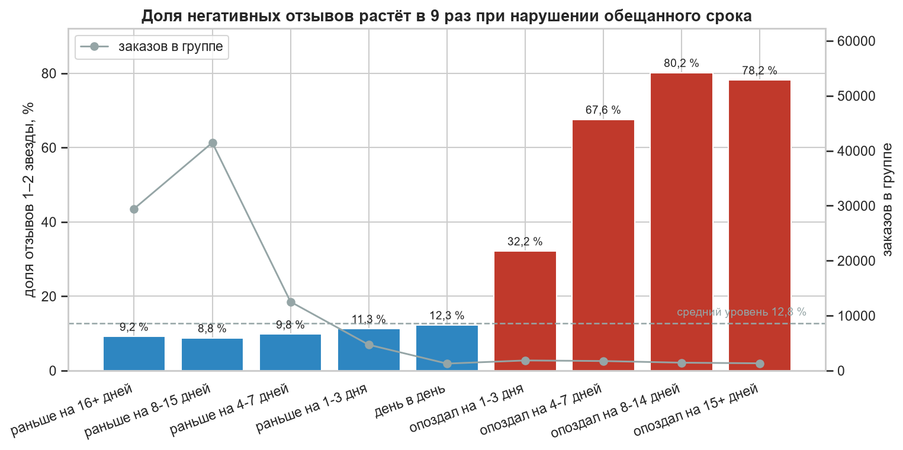
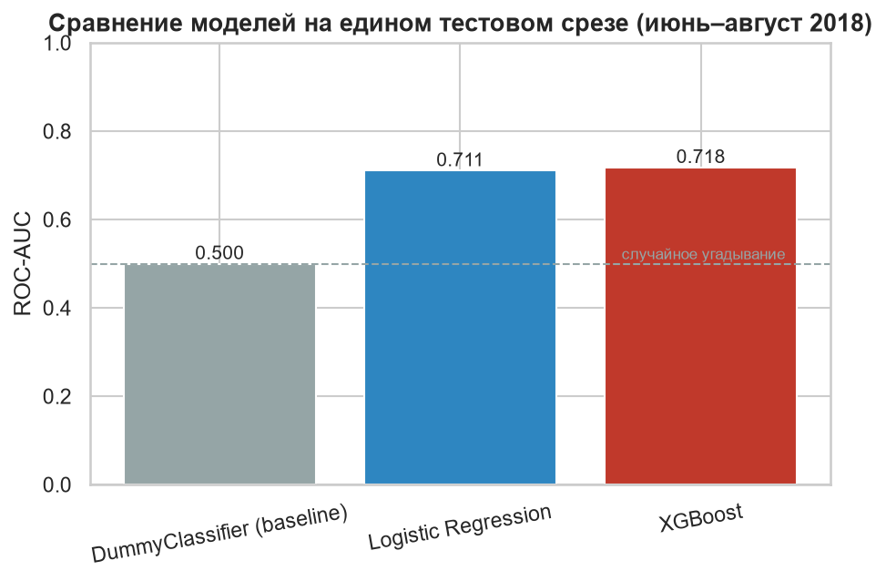
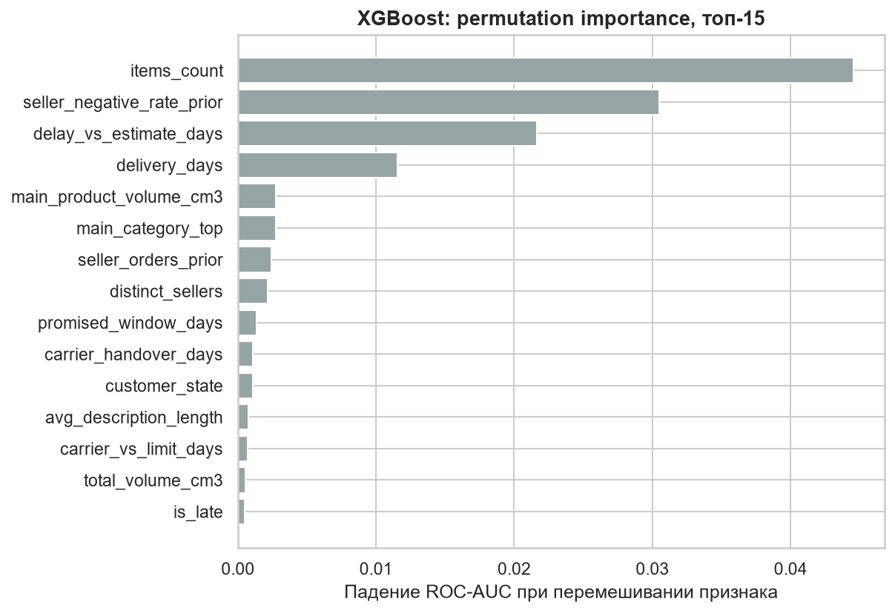

# Прогноз негативного отзыва клиента Olist

Capstone-проект: по данным, известным в момент вручения заказа, предсказать,
что клиент поставит низкую оценку (1–2 звезды), ещё до того, как он её оставил.

**Главный результат.** XGBoost достигает ROC-AUC 0,718 на отложенном периоде
(июнь–август 2018) против 0,5 у случайного угадывания. Если отобрать 5 % самых
рискованных заказов, примерно каждый второй из них (49,4 %) действительно
получит низкую оценку — в 5 раз чаще, чем в среднем по тестовому периоду (9,7 %).
Сильнейший фактор — нарушенный срок доставки: опоздавшие заказы составляют
6,7 % выборки, но дают треть всего негатива.

---

## Бизнес-задача

Olist — бразильский маркетплейс, объединяющий тысячи небольших продавцов.
После доставки клиент ставит оценку от 1 до 5 звёзд. Низкая оценка бьёт
по репутации продавца, отпугивает повторную покупку и сообщает о проблеме
в логистике, когда исправлять уже поздно.

Если заранее знать, кто из клиентов в группе риска, можно вмешаться до отзыва:
предупредить о задержке, извиниться, предложить компенсацию. Модель нужна,
чтобы направить ограниченный ресурс службы поддержки на тех, кому он
действительно нужен.

**Постановка:** бинарная классификация с дисбалансом классов.

| | |
|---|---|
| `target = 1` | оценка 1–2 звезды (явное недовольство) — 12,8 % выборки |
| `target = 0` | оценка 3–5 звёзд |

**Почему порог `score <= 2`.** Он отделяет явный провал от всего остального.
Одна или две звезды — это понятное бизнес-событие и повод для вмешательства.
Три звезды — нейтральная зона: если отнести её к негативу, сигнал размоется,
а служба поддержки будет тратить силы на в целом довольных клиентов.

**Точка отсечки.** Все признаки должны быть известны в момент вручения заказа.
Поэтому в выборку попадают только доставленные заказы с датой вручения,
а из таблицы отзывов берётся одно поле, `review_score`. Даты отзыва, ответ
на отзыв и текст комментария возникают после целевого события и в признаки
не попадают. `src/build_features.py` проверяет это автоматически при каждой
сборке витрины.

---

## Данные

[Brazilian E-Commerce Public Dataset by Olist](https://www.kaggle.com/datasets/olistbr/brazilian-ecommerce):
9 связанных CSV-файлов, около 100 тысяч заказов за 2016–2018 годы.

| Таблица в БД | Исходный файл | Строк | Что содержит |
|---|---|---|---|
| `orders` | `olist_orders_dataset.csv` | 99 441 | статус и четыре даты жизненного цикла заказа |
| `order_items` | `olist_order_items_dataset.csv` | 112 650 | позиции заказа: товар, продавец, цена, доставка |
| `order_payments` | `olist_order_payments_dataset.csv` | 103 886 | способ оплаты, рассрочка, сумма |
| `order_reviews` | `olist_order_reviews_dataset.csv` | 99 224 | оценка 1–5 (источник целевой переменной) |
| `customers` | `olist_customers_dataset.csv` | 99 441 | город, штат и zip-префикс покупателя |
| `products` | `olist_products_dataset.csv` | 32 951 | категория, вес, габариты, фото, описание |
| `sellers` | `olist_sellers_dataset.csv` | 3 095 | город, штат и zip-префикс продавца |
| `geolocation` | `olist_geolocation_dataset.csv` | 1 000 163 | координаты по zip-префиксу |
| `category_translation` | `product_category_name_translation.csv` | 73 | перевод категорий на английский |

**Итоговая выборка:** 95 824 заказа (статус `delivered`, есть дата вручения
и отзыв), из них 12 262 негативных.

**Дефекты исходных данных, которые обработаны при загрузке:**

- `review_id` не уникален (99 224 строки на 98 410 id), поэтому первичный ключ
  в `order_reviews` составной — `(review_id, order_id)`. У 547 заказов несколько
  отзывов, и в витрине остаётся самый ранний по `review_creation_date`.
- В `products` есть две категории, которых нет в файле переводов
  (`pc_gamer`, `portateis_cozinha_e_preparadores_de_alimentos`, 13 товаров).
  `build_db.py` дописывает их в справочник, иначе нарушается внешний ключ.
- Zip-префиксы имеют ведущие нули (`01037`), поэтому хранятся как `TEXT`.
- Файл переводов начинается с BOM и читается в кодировке `utf-8-sig`.

---

## Схема базы данных

SQLite, 9 таблиц, внешние ключи с проверкой при загрузке (`PRAGMA foreign_keys = ON`)
и 15 индексов по полям соединений и фильтров. DDL лежит в
[`sql/01_schema.sql`](sql/01_schema.sql).

```mermaid
erDiagram
    customers ||--o{ orders : "customer_id"
    orders ||--|{ order_items : "order_id"
    orders ||--|{ order_payments : "order_id"
    orders ||--o{ order_reviews : "order_id"
    products ||--o{ order_items : "product_id"
    sellers ||--o{ order_items : "seller_id"
    category_translation ||--o{ products : "product_category_name"
    geolocation }o..o{ customers : "zip_code_prefix"
    geolocation }o..o{ sellers : "zip_code_prefix"

    orders {
        TEXT order_id PK
        TEXT customer_id FK
        TEXT order_status
        TEXT order_purchase_timestamp
        TEXT order_approved_at
        TEXT order_delivered_carrier_date
        TEXT order_delivered_customer_date "точка отсечки"
        TEXT order_estimated_delivery_date
    }
    order_items {
        TEXT order_id PK, FK
        INTEGER order_item_id PK
        TEXT product_id FK
        TEXT seller_id FK
        TEXT shipping_limit_date
        REAL price
        REAL freight_value
    }
    order_payments {
        TEXT order_id PK, FK
        INTEGER payment_sequential PK
        TEXT payment_type
        INTEGER payment_installments
        REAL payment_value
    }
    order_reviews {
        TEXT review_id PK
        TEXT order_id PK, FK
        INTEGER review_score "источник target"
        TEXT review_creation_date
    }
    customers {
        TEXT customer_id PK
        TEXT customer_unique_id
        TEXT customer_zip_code_prefix
        TEXT customer_state
    }
    products {
        TEXT product_id PK
        TEXT product_category_name FK
        REAL product_weight_g
        INTEGER product_photos_qty
    }
    sellers {
        TEXT seller_id PK
        TEXT seller_zip_code_prefix
        TEXT seller_state
    }
    category_translation {
        TEXT product_category_name PK
        TEXT product_category_name_english
    }
    geolocation {
        TEXT geolocation_zip_code_prefix
        REAL geolocation_lat
        REAL geolocation_lng
    }
```



На диаграмме показаны ключевые поля, полный список колонок есть в DDL.
Связь `geolocation` с покупателями и продавцами логическая (по zip-префиксу),
без внешнего ключа: на один префикс приходится много точек.

**Витрина признаков.** [`sql/03_features.sql`](sql/03_features.sql) собирает
материализованную таблицу `order_features` (95 824 × 43, одна строка на заказ)
одним CTE-запросом. Он соединяет все таблицы, кроме `geolocation`, агрегирует
позиции и платежи и считает логистические интервалы через `julianday()`.
Python читает готовую витрину одним `SELECT *`.

---

## Структура репозитория

```
├── sql/
│   ├── 01_schema.sql         # DDL: таблицы, PK, FK, индексы
│   ├── 02_checks.sql         # 10 проверок сырого слоя
│   ├── 03_features.sql       # витрина order_features (JOIN + CTE)
│   └── 04_analytics.sql      # 10 аналитических разрезов для EDA
├── src/
│   ├── build_db.py           # загрузка CSV → SQLite
│   ├── build_features.py     # сборка витрины и её проверки
│   └── features.py           # история продавца, пропуски, разбиение train/test
├── notebooks/
│   ├── 02_eda.ipynb          # разведочный анализ
│   └── 03_modeling.ipynb     # модели, метрики, интерпретация
├── reports/figures/          # 15 графиков для отчёта и презентации
├── data/raw/                 # CSV с Kaggle (не в репозитории)
├── db/                       # olist.db (не в репозитории)
└── requirements.txt
```

---

## Как воспроизвести

Нужен Python 3.14 (на нём зафиксированы версии в `requirements.txt`).

1. Скачать датасет с [Kaggle](https://www.kaggle.com/datasets/olistbr/brazilian-ecommerce)
   и распаковать 9 CSV в `data/raw/`.
2. Установить зависимости:
   ```
   pip install -r requirements.txt
   ```
3. Собрать базу (~30 секунд, около 180 МБ):
   ```
   python src/build_db.py
   ```
4. Собрать витрину признаков и проверить её (~13 секунд):
   ```
   python src/build_features.py
   ```
5. Выполнить ноутбуки по порядку, каждый целиком (`Run All`):
   `notebooks/02_eda.ipynb`, затем `notebooks/03_modeling.ipynb`.
   Графики сохраняются в `reports/figures/`.

Скрипты идемпотентны: SQL-файлы начинаются с `DROP TABLE`, поэтому повторный
запуск пересобирает то же самое, а не удваивает строки. Дополнительные режимы:

```
python src/build_db.py --check-only        # проверки готовой базы без пересборки
python src/build_features.py --check-only  # проверки готовой витрины
python src/build_features.py --checks      # выполнить sql/02_checks.sql
python src/build_features.py --analytics   # вывести все разрезы sql/04_analytics.sql
```

---

## Разведочный анализ

Все разрезы считаются в SQL ([`sql/04_analytics.sql`](sql/04_analytics.sql)),
ноутбук только рисует результат. Ключевые находки:



1. **Решает нарушенное обещание, а не сам срок.** Пока заказ приходит в срок
   или раньше, негатив держится около 9 % и не зависит от того, насколько
   раньше. После обещанной даты он резко растёт: опоздание на 1–3 дня даёт
   32,2 % негатива, на 4–7 дней — 67,6 %, на 8–14 дней — 80,2 %.
2. **Опоздания — треть всего негатива.** Опоздавших заказов 6,7 %, а негативных
   отзывов они дают 32,5 %.
3. **География вторична.** Общий уровень негатива по штатам разнится почти
   вдвое (10,7 % в SP против 19,9 % в MA). Но среди заказов, доставленных
   в срок, все штаты укладываются в коридор 8,2–11,5 %: регион влияет через
   вероятность опоздания, а не сам по себе.
4. **Товар и оплата — слабый сигнал.** Между крупными категориями разница
   около 5 п. п., между способами оплаты — 2,5 п. п.
5. **Заказы у нескольких продавцов рискованны.** При двух продавцах в заказе
   негатив 46,7 %, при трёх и больше — 64,4 %, хотя опозданий в этой группе
   меньше среднего. Вероятная причина — посылки приходят по частям.
6. **Пропусков мало.** Максимум — 1,41 % в одной колонке. Категория без
   значения становится `unknown`, числовые пропуски заполняются медианой,
   посчитанной только по train.

---

## Модели и результаты

**Валидация.** Выборка разбита по времени: train — сентябрь 2016 – май 2018
(77 304 заказа), test — июнь–август 2018 (18 520 заказов, 19,3 %). Случайное
разбиение завысило бы метрику: заказы одного месяца делят общую логистическую
обстановку. Гиперпараметры подобраны 5-fold `StratifiedKFold` внутри train.

**Метрика — ROC-AUC.** Она показывает, насколько хорошо модель ранжирует
заказы по риску, и не зависит от доли классов. Позитивный класс редкий,
и accuracy здесь бесполезна: модель, которая всегда отвечает «негатива
не будет», получает на test 90,3 % accuracy и не находит ни одного
недовольного клиента.

**Защита от утечки.** История продавца (`seller_negative_rate_prior`)
считается только по его заказам, оформленным раньше текущего. Медианы для
пропусков и список топ-15 категорий строятся только на train.

| Модель | ROC-AUC | Precision в top-5 % |
|---|---|---|
| `DummyClassifier` (нулевая отметка) | 0,500 | 10,5 % |
| Logistic Regression | 0,711 | 46,1 % |
| **XGBoost** | **0,718** | **49,4 %** |

Все модели оценены на одном и том же тестовом срезе. Доля негатива в test
(9,7 %) ниже, чем в train (13,5 %), потому что в 2018 году Olist наладил
логистику. Для модели это более строгая проверка, чем случайное разбиение.

По ROC-AUC модели почти равны. XGBoost выбран потому, что он точнее в верхушке
списка, а именно с ней работает служба поддержки: среди 5 % самых рискованных
заказов у него 49,4 % реального негатива против 46,1 % у логистической
регрессии.



**Порог решения** выбирается по пропускной способности службы поддержки,
а не по значению 0,5:

| Доля заказов в работу | ≈ заказов в день | Precision | Recall |
|---|---|---|---|
| top-5 % | 10 | 49,4 % | 25,4 % |
| top-15 % | 31 | 28,4 % | 43,8 % |

---

## Интерпретация

Коэффициенты логистической регрессии переведены в процентные пункты
вероятности негатива, а для XGBoost посчитана permutation importance.
Обе модели сходятся в главном.



- **Факт опоздания** (`is_late`) повышает вероятность негатива на **+23,9 п. п.**
  Это самый сильный отдельный эффект. Каждый следующий день просрочки добавляет
  лишь +0,19 п. п.: клиент реагирует на сорванное обещание как на событие,
  а не пропорционально числу дней.
- **История продавца**: разница между продавцом без негатива в прошлом
  и продавцом со 100 % негатива — +19,2 п. п.
- **Каждый дополнительный продавец в заказе** добавляет +16,4 п. п.
- В permutation importance XGBoost первые места занимают
  `items_count` и `seller_negative_rate_prior`, за ними
  `delay_vs_estimate_days` и `delivery_days`.

---

## Рекомендации бизнесу

1. **Реагировать в момент, когда заказ пересекает обещанную дату.**
   Это главный переломный момент. Автоматическое уведомление о задержке
   или компенсация в этот момент нацелены на основной источник негатива.
2. **Обещать реалистичный срок.** Досрочная доставка почти не улучшает оценку,
   а опоздание резко её ухудшает. Выгоднее указать в карточке срок с запасом,
   чем ускорять доставку. Особенно это важно для штатов, где сроки срываются
   чаще всего (AL, MA, RJ).
3. **Настроить объём работы по модели под мощности команды.** При 10 заказах
   в день каждый второй звонок попадает в клиента, который иначе поставил бы
   1–2 звезды. Таблица top-K позволяет пересчитать precision и recall под
   любой бюджет.
4. **Собирать отгрузку у одного продавца там, где это возможно.**
   Раздробленные заказы рискованны даже при соблюдении сроков.
5. **Следить за продавцами с плохой историей**, но осторожно с новыми:
   при коротком прошлом доля негатива продавца статистически неустойчива.

**Ограничения.** Метрики получены на одном временном срезе, поэтому
доверительный интервал оценки шире, чем дала бы кросс-валидация по всей
выборке. Дат вручения по отдельным посылкам в данных нет, поэтому гипотезу
о частичной доставке проверить нельзя. Текст отзывов не используется:
он появляется после целевого события, а NLP не входит в рамки проекта.

---

## Стек

Python 3.14, SQLite, pandas, NumPy, scikit-learn, XGBoost, matplotlib, seaborn.
